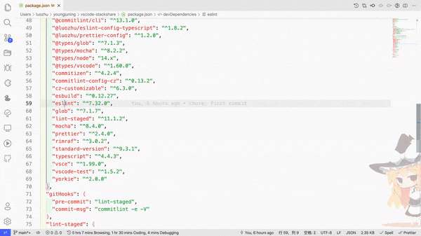

# vscode-npm-trends

vscode hover extension for https://www.npmtrends.com/

## Features

## Inspired by

- [vscode npm](https://github.com/microsoft/vscode/tree/main/extensions/npm)
- [varlet-vscode-extension](https://github.com/haoziqaq/varlet/tree/dev/packages/varlet-vscode-extension/)
